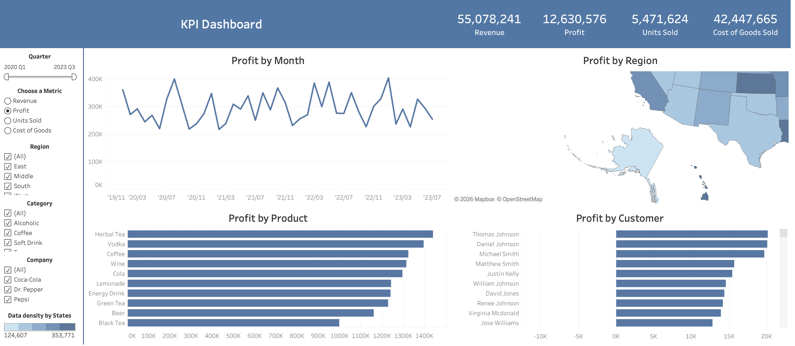

# Soda Sales in the US – An Interactive Dashboard



## Project Overview
This interactive Tableau dashboard analyzes soda sales performance across the United States with a focus on profitability.

The dashboard is designed to provide a quick and intuitive overview of business performance through four key analytical perspectives: time, geography, product, and customer.

## Main Dashboard Components
- **Profit by Month** – tracks profitability trends over time
- **Profit by Region** – compares regional business performance
- **Profit by Product** – identifies the most and least profitable products
- **Profit by Customer** – highlights customer-level profitability

## Objectives
- Explore profitability patterns across different business dimensions
- Identify strong and weak performing regions
- Evaluate product-level contribution to profit
- Understand which customers generate the highest value

## Business Value
This dashboard helps support business decision-making by making it easier to:
- monitor profit trends
- compare regional performance
- identify high-performing products
- evaluate customer profitability

## Tools Used
- Tableau
- CSV dataset
- GitHub

## Tableau Public Link
[View the interactive dashboard here](https://public.tableau.com/views/SodaSales_17712591810320/Dashboard1)

## Dataset
The dataset used for this project is included in this repository.

## Folder Structure
```text
soda-sales-us/
├── README.md
├── soft_drink_sales.csv
└── soda-dashboard-preview.png
